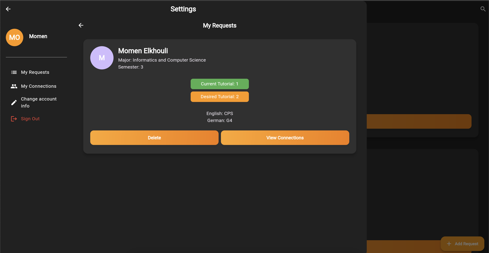

# GIU-Connect 🌐

**GIU-Connect** is an innovative platform designed to support students at the German International University (GIU) in identifying suitable partners for tutorial exchanges. By fostering connections among peers with shared academic objectives, GIU-Connect enhances collaborative learning. 🤝

## GIU-Connect Demo 🎥


## GIU-Connect Screenshot 🖼️



## How It Works 🔄

1. **Register:** Sign up effortlessly using your @student.giu-uni.de email address. ✉️
2. **Add Request:** Specify the tutorial you wish to exchange along with the one you currently have. 📚
3. **Connect:** Explore requests and connect with fellow students to facilitate effective tutorial exchanges. 🌟

## Technology Stack ⚙️

- **Flutter:** Developed with Flutter to deliver a seamless and high-performance user experience.
- **Firebase:** Leverages Firebase for robust backend services, including database management and authentication.
## Contributing 🤝

We welcome contributions from the community to enhance GIU-Connect. Your involvement is vital to the platform's success!

### How to Contribute

1. **Identify an Area of Contribution:** You can help by fixing bugs, adding new features, improving documentation, or suggesting enhancements.
2. **Fork the Repository:** Create your own copy of the repository by forking it.
3. **Create a New Branch:** 
   ```git checkout -b feature/your-feature-name``` Replace your-feature-name with a descriptive name for your feature.)
4. **Make Your Changes:** Implement your changes and test thoroughly.
5. **Commit Your Changes:** Write clear and concise commit messages to explain your modifications.
6. **Push Your Branch:** ```git push origin feature/your-feature-name```
7. **Submit a Pull Request:** Open a pull request on the main repository, detailing the changes made and their benefits.

### Important Note on Firebase API Keys 🔑

For security reasons, the Firebase API keys for the production database are not provided in this repository. To contribute and test your changes, please follow these steps to create a new Firebase project:

1. **Create a Firebase Project:**
   - Go to the [Firebase Console](https://console.firebase.google.com/).
### How to Contribute

1. **Identify an Area of Contribution:** You can help by fixing bugs, adding new features, improving documentation, or suggesting enhancements.
2. **Fork the Repository:** Create your own copy of the repository by forking it.
3. **Create a New Branch:** 
   ```git checkout -b feature/your-feature-name``` Replace your-feature-name with a descriptive name for your feature.)
4. **Make Your Changes:** Implement your changes and test thoroughly.
5. **Commit Your Changes:** Write clear and concise commit messages to explain your modifications.
6. **Push Your Branch:** ```git push origin feature/your-feature-name```
7. **Submit a Pull Request:** Open a pull request on the main repository, detailing the changes made and their benefits.

### Important Note on Firebase API Keys 🔑

For security reasons, the Firebase API keys for the production database are not provided in this repository. To contribute and test your changes, please follow these steps to create a new Firebase project:

1. **Create a Firebase Project:**
   - Go to the [Firebase Console](https://console.firebase.google.com/).
### How to Contribute

1. **Identify an Area of Contribution:** You can help by fixing bugs, adding new features, improving documentation, or suggesting enhancements.
2. **Fork the Repository:** Create your own copy of the repository by forking it.
3. **Create a New Branch:** 
   ```git checkout -b feature/your-feature-name``` Replace your-feature-name with a descriptive name for your feature.)
4. **Make Your Changes:** Implement your changes and test thoroughly.
5. **Commit Your Changes:** Write clear and concise commit messages to explain your modifications.
6. **Push Your Branch:** ```git push origin feature/your-feature-name```
7. **Submit a Pull Request:** Open a pull request on the main repository, detailing the changes made and their benefits.

### Important Note on Firebase API Keys 🔑

For security reasons, the Firebase API keys for the production database are not provided in this repository. To contribute and test your changes, please follow these steps to create a new Firebase project:

1. **Create a Firebase Project:**
   - Go to the [Firebase Console](https://console.firebase.google.com/).
   - Click on "Add Project" and follow the prompts to create a new project.

2. **Configure Your Project:**
   - Once your project is created, navigate to the project dashboard.
   - Click on "Project Settings" (the gear icon next to "Project Overview").

3. **Add Your App:**
   - Depending on your testing platform (Web, iOS, Android, etc.), follow these steps:
     - **For Web:**
       - Under the "General" tab, scroll down to the "Your apps" section and click on "Web" to add a new web app.
     - **For iOS:**
       - Click on "iOS" to register your app. Provide your iOS bundle ID.
     - **For Android:**
       - Click on "Android" to register your app. Provide your Android package name.

4. **Obtain Your API Keys:**
   - After registering your app, you'll see your Firebase SDK configuration. Copy the `apiKey`, `authDomain`, `projectId`, `storageBucket`, `messagingSender`, `appId`, `measurementId` and other necessary details based on the platform you chose.

5. **Enable Authentication:**
   - Navigate to the **Authentication** section in the Firebase Console.
   - Click on "Get Started" and enable the **Email/Password** sign-in method.

6. **Enable Firebase Database:**
   - Go to the **Realtime Database** section in the Firebase Console.
   - Click on "Create Database" and choose the appropriate rules for your project (start in test mode if needed).

7. **Set Up Your Environment:**
   - In the root directory of your cloned repository, create or open the `.env` file located in `assets/`.
   - Make sure to replace the placeholders with the actual values from your Firebase project.

8. **Test Your Changes:**
   - You can now run the application locally using your new Firebase project. Ensure that all functionalities are working as expected before submitting your contributions.
   
### Other Ways to Contribute 🤝

- **Report Issues:** If you encounter any bugs or have suggestions for improvements, please open an issue in the repository to help us address them.
- **Enhance Documentation:** Contributions to improve the README or other documentation files are always appreciated. Clear and comprehensive documentation benefits everyone!
- **Share Your Feedback:** We welcome your insights and ideas. Share your thoughts on how we can enhance the platform and user experience.
- **Promote GIU-Connect:** Spread the word about GIU-Connect within your network. The more students we reach, the more valuable our community becomes!
- **Participate in Discussions:** Engage with the community through discussions and forums to share knowledge and best practices.

Thank you for your support in making GIU-Connect a better resource for all students! 🌟

## Future Plans 🚀

- **GUC Student Support:** Expand the platform to include students from the German University in Cairo (GUC).
- **Notification System:** Implement notifications to alert users when a match is found. 🔔
- **In-App Communication:** Enable direct messaging capabilities between matched students. 💬

## Contact 📞

For inquiries, feedback, or collaboration opportunities, please contact:  
[momen.elkhouli@student.giu-uni.de](mailto:momen.elkhouli@student.giu-uni.de)

---

Thank you for your interest in GIU-Connect. We look forward to enhancing the academic experience at GIU through collaborative learning! 🎉
